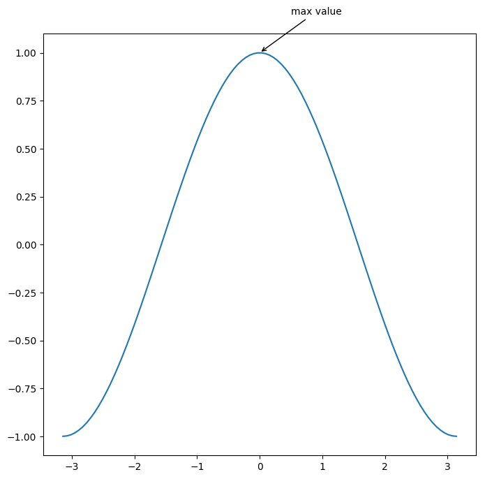

## matplotlib.axes.Axes.annotate
____

* Annotate the point xy with text s.
> Additional kwards are passed to Text.

Parameters | Descriptions
-----------|-------------
s | str, The text of the annotate
xy | iterable, Length 2 sequence specifying the (x,y) point to annotate.
xytext | iterable, optional, Length 2 sequence specifying the (x,y) to place the text at. if None, defaults to xy.
xycoords | The coordinates system that xy is given in, 推荐'data'
textcoords | The coordinates system that xytext is given, 推荐'data'
arrowprops | dict, 描述箭头属性的字典。

## 箭头属性的描述
Key | Descriptions
----|-------------
arrowstyle | 箭头形状的一个样式表
width | the width of the arrow in points
headwidth | the width of the base of the arrow head in points 
headlength | the length of the arrow head in points 
shrink | fraction of toral length to 'shrink' from both ends
? | any key to matplotlib.patches.FancyArrowPatch


```python
import matplotlib.pyplot as plt
import numpy as np

x = np.linspace(-np.pi, np.pi, 100)
y = np.cos(x)

fig = plt.figure(figsize=(8, 8), dpi=100)
ax = fig.add_subplot(1, 1, 1)
ax.plot(x, y)
ax.annotate("max value", xy=(0, 1), xytext=(0.5, 1.2), xycoords='data', textcoords='data',
arrowprops={'arrowstyle' : "->"})
plt.show()

```




