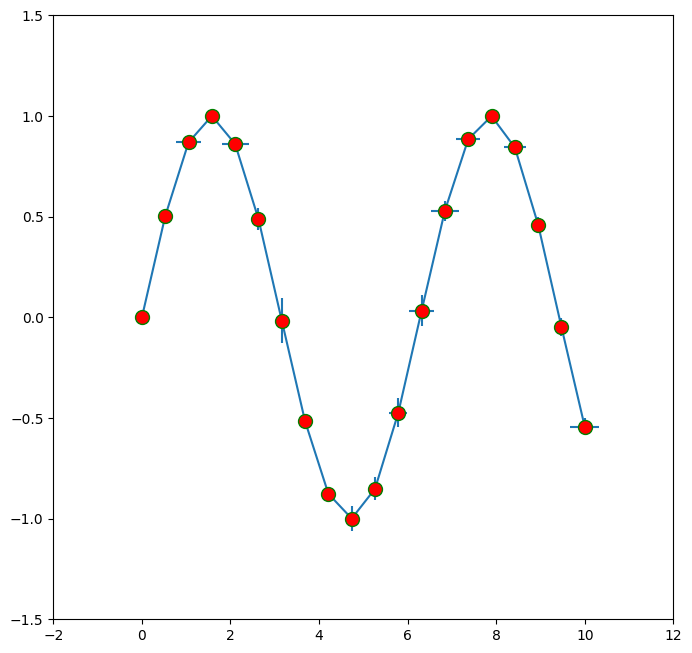

# matplotlib.axes.Axes.errorbar
* Axes.errorbar(x, y, yerr=None, xerr=None, fmt='', ecolor=None, elinewidth=None, capsize=None, barsabove=False, lolims=False, uplims=False, xlolims=False, xuplims=False, errorevery=1, capthick=None, **kwargs)

 画一个误差的图像。

> x, y, xerr, and yerr can all be scalars, which plots a single error bar at x, y.


```python
import numpy as np
import matplotlib.pyplot as plt

x = np.linspace(0, 10, 20)
y = np.sin(x)
xerr = np.random.uniform(size=20)/3
yerr = np.random.normal(0, 2, size=20)/40

fig = plt.figure(figsize=(8, 8), dpi=100)
axe = fig.add_subplot(1, 1, 1)
axe.errorbar(x, y, yerr=yerr, xerr=xerr, marker='o', markerfacecolor='red', mec='green',
            markersize=10)
axe.set_xlim(-2, 12)
axe.set_ylim(-1.5, 1.5)
plt.show()
```





1. 详细的说明请看[这里](http://matplotlib.org/api/_as_gen/matplotlib.axes.Axes.errorbar.html#matplotlib.axes.Axes.errorbar)
