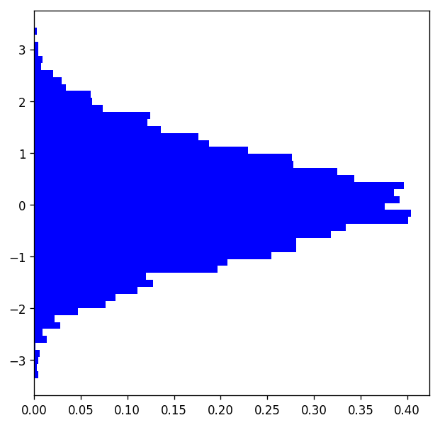

## matplotlib.axes.Axes.hist
____
* Axes.hist(x, bins=None, range=None, normed=False, weights=None, cumulative=False, bottom=None, histtype='bar', align='mid', orientation='vertical', rwidth=None, log=False, color=None, label=None, stacked=False, **kwargs)  

* Plot a histogram.  
* Compute and draw the histogram of x. The return value is a tuple (n, bins, patches) or ([n0, n1, ...], bins, [patches0, patches1,...]) if the input contains multiple data  
* (注意该函数的返回值).
____

> Parameters:  

Parameter | Description 
----------|------------
 x: | (n,) array or sequence of (n,) arrays. 
  | Input values, this takes either a single array or a sequency of arrays which are not    required to be of the same length
bins: | integer or array_like or ‘auto’, optional (bin的个数的控制)
 | If an integer is given, bins + 1 bin edges are returned,(注意返回的不是bin值,而是bin的边缘的数值) consistently with numpy.histogram() for numpy version >= 1.3.
range | tuple or None, optional(不同bin宽的设置.)
 | The lower and upper range of the bins. Lower and upper outliers are ignored. If not provided, range is (x.min(), x.max()). Range has no effect if bins is a sequence.
 | If bins is a sequence or range is specified, autoscaling is based on the specified bin range instead of the range of x.
normed | boolean, optional(归一化的控制)
 | If True, the first element of the return tuple will be the counts normalized to form a probability density, i.e., n/(len(x)`dbin), i.e., the integral of the histogram will sum to 1. If stacked is also True, the sum of the histograms is normalized to 1.
normed | boolean, optional
 | If True, the first element of the return tuple will be the counts normalized to form a probability density, i.e., n/(len(x)`dbin), i.e., the integral of the histogram will sum to 1. If stacked is also True, the sum of the histograms is normalized to 1.
weights | (n, ) array_like or None, optional
 | An array of weights, of the same shape as x. Each value in x only contributes its associated weight towards the bin count (instead of 1). If normed is True, the weights are normalized, so that the integral of the density over the range remains 1.
cumulative | boolean, optional
 | If True, then a histogram is computed where each bin gives the counts in that bin plus all bins for smaller values. The last bin gives the total number of datapoints. If normed is also True then the histogram is normalized such that the last bin equals 1. If cumulative evaluates to less than 0 (e.g., -1), the direction of accumulation is reversed. In this case, if normed is also True, then the histogram is normalized such that the first bin equals 1.
bottom | array_like, scalar, or None
 | Location of the bottom baseline of each bin. If a scalar, the base line for each bin is shifted by the same amount. If an array, each bin is shifted independently and the length of bottom must match the number of bins. If None, defaults to 0.
histtype | {‘bar’, ‘barstacked’, ‘step’, ‘stepfilled’}, optional
 | The type of histogram to draw.
align | {‘left’, ‘mid’, ‘right’}, optional
 | Controls how the histogram is plotted.
orientation | {‘horizontal’, ‘vertical’}, optional
 | If ‘horizontal’, barh will be used for bar-type histograms and the bottom kwarg will be the left edges.
rwidth | scalar or None, optional
 | The relative width of the bars as a fraction of the bin width. If None, automatically compute the width. Ignored if histtype is ‘step’ or ‘stepfilled’.
log | boolean, optional
 | If True, the histogram axis will be set to a log scale. If log is True and x is a 1D array, empty bins will be filtered out and only the non-empty (n, bins, patches) will be returned.
color | color or array_like of colors or None, optional
label | string or None, optional
stacked | boolean, optional


```python
import matplotlib.pyplot as plt
import numpy as np
"""
author : xiaohai
email : xiaohaijin@outlook.com
"""

fig = plt.figure(figsize=(6, 6), dpi=120)
ax = fig.add_subplot(1, 1, 1)
x = np.random.randn(5000)
n, bins, rects = ax.hist(x, bins=50, facecolor='blue', range=(x.min(), x.max()),normed=True, orientation='horizontal')

plt.show()
```




